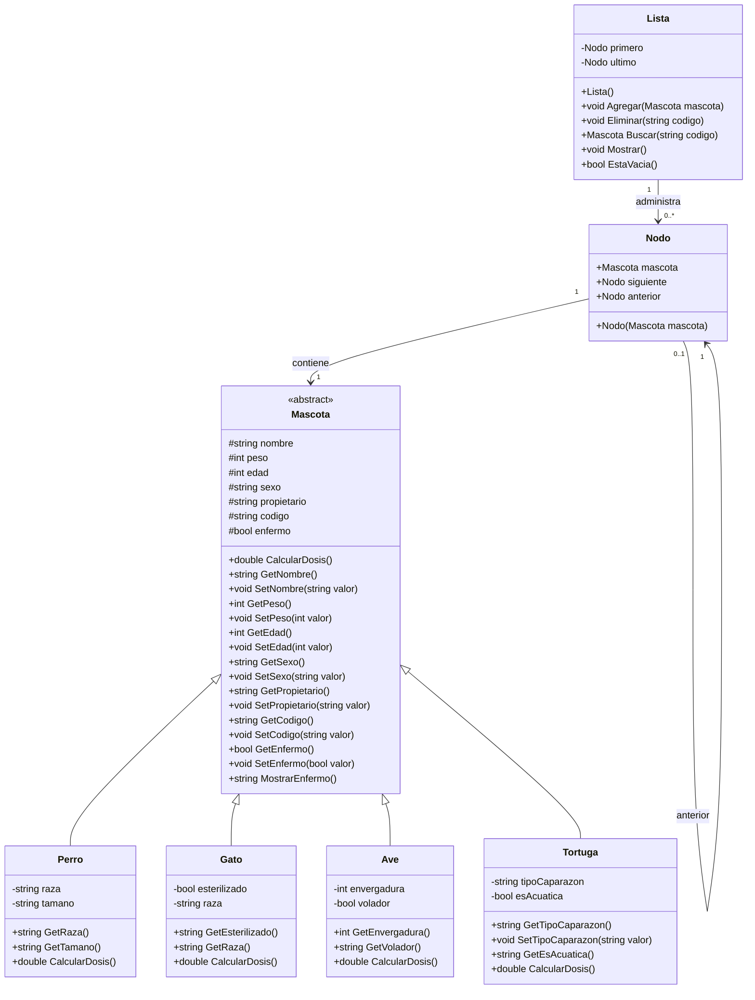

# Diagrama de Clases

```mermaid
classDiagram

    class Mascota {
        <<abstract>>
        #string nombre
        #int peso
        #int edad
        #string sexo
        #string propietario
        #string codigo
        #bool enfermo
        +double CalcularDosis()
        +string GetNombre()
        +void SetNombre(string valor)
        +int GetPeso()
        +void SetPeso(int valor)
        +int GetEdad()
        +void SetEdad(int valor)
        +string GetSexo()
        +void SetSexo(string valor)
        +string GetPropietario()
        +void SetPropietario(string valor)
        +string GetCodigo()
        +void SetCodigo(string valor)
        +bool GetEnfermo()
        +void SetEnfermo(bool valor)
        +string MostrarEnfermo()
    }

    class Perro {
        -string raza
        -string tamano
        +string GetRaza()
        +string GetTamano()
        +double CalcularDosis()
    }

    class Gato {
        -bool esterilizado
        -string raza
        +string GetEsterilizado()
        +string GetRaza()
        +double CalcularDosis()
    }

    class Ave {
        -int envergadura
        -bool volador
        +int GetEnvergadura()
        +string GetVolador()
        +double CalcularDosis()
    }

    class Tortuga {
        -string tipoCaparazon
        -bool esAcuatica
        +string GetTipoCaparazon()
        +void SetTipoCaparazon(string valor)
        +string GetEsAcuatica()
        +double CalcularDosis()
    }

    class Nodo {
        +Mascota mascota
        +Nodo siguiente
        +Nodo anterior
        +Nodo(Mascota mascota)
    }

    class Lista {
        -Nodo primero
        -Nodo ultimo
        +Lista()
        +void Agregar(Mascota mascota)
        +void Eliminar(string codigo)
        +Mascota Buscar(string codigo)
        +void Mostrar()
        +bool EstaVacia()
    }

    Mascota <|-- Perro
    Mascota <|-- Gato
    Mascota <|-- Ave
    Mascota <|-- Tortuga

    Nodo "1" --> "1" Mascota : contiene
    Nodo "0..1" --> "1" Nodo : siguiente
    Nodo "0..1" --> "1" Nodo : anterior

    Lista "1" --> "0..*" Nodo : administra
```
