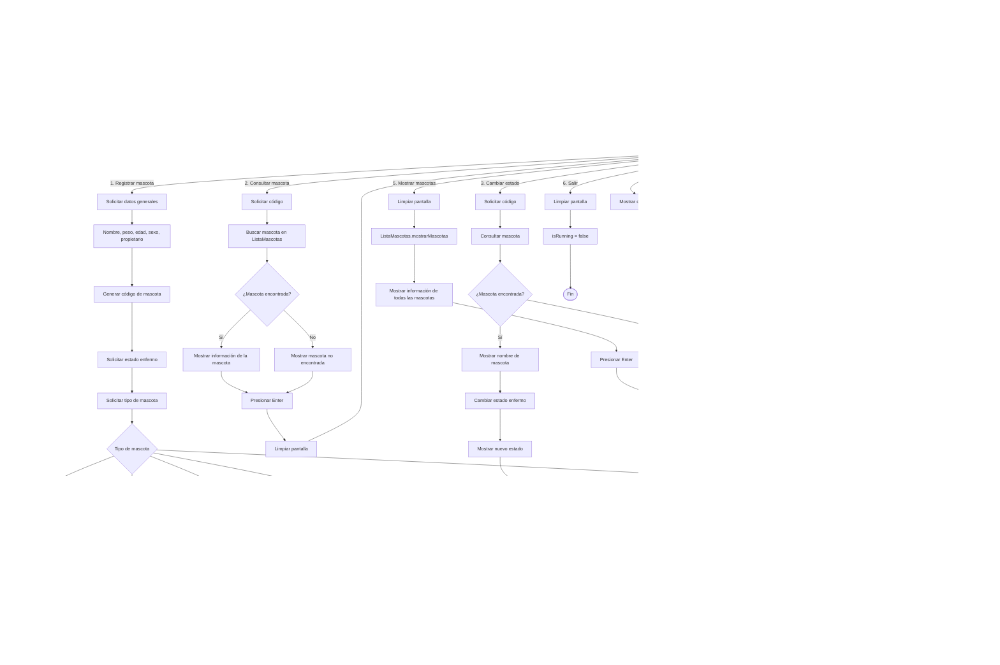

# Diagrama de flujo

```mermaid
flowchart TD
    A([Inicio]) --> B[Crear ListaMascotas]

    B --> C[Agregar mascotas de prueba]
    C --> D[isRunning = true]

    D --> E{Mostrar menú}

    E -->|1. Registrar mascota| F[Solicitar datos generales]
    F --> G[Nombre, peso, edad, sexo, propietario]
    G --> H[Generar código de mascota]
    H --> I[Solicitar estado enfermo]
    I --> J[Solicitar tipo de mascota]

    J --> K{Tipo de mascota}

    K -->|Perro| L[Solicitar raza y tamaño]
    L --> M[Crear objeto Perro]
    M --> N[Agregar Perro a ListaMascotas]

    K -->|Gato| O[Solicitar raza y estado de esterilización]
    O --> P[Crear objeto Gato]
    P --> Q[Agregar Gato a ListaMascotas]

    K -->|Ave| R[Solicitar envergadura y si puede volar]
    R --> S[Crear objeto Ave]
    S --> T[Agregar Ave a ListaMascotas]

    K -->|Tortuga| U[Solicitar tipo de caparazón y si es acuática]
    U --> V[Crear objeto Tortuga]
    V --> W[Agregar Tortuga a ListaMascotas]

    K -->|Otro| X[Mostrar tipo de mascota no válido]

    N --> Y[Presionar Enter]
    Q --> Y
    T --> Y
    W --> Y
    X --> Y
    Y --> Z[Limpiar pantalla]
    Z --> E

    E -->|2. Consultar mascota| AA[Solicitar código]
    AA --> AB[Buscar mascota en ListaMascotas]
    AB --> AC{¿Mascota encontrada?}
    AC -->|Sí| AD[Mostrar información de la mascota]
    AC -->|No| AE[Mostrar mascota no encontrada]
    AD --> AF[Presionar Enter]
    AE --> AF
    AF --> AG[Limpiar pantalla]
    AG --> E

    E -->|3. Cambiar estado| AH[Solicitar código]
    AH --> AI[Consultar mascota]
    AI --> AJ{¿Mascota encontrada?}
    AJ -->|Sí| AK[Mostrar nombre de mascota]
    AK --> AL[Cambiar estado enfermo]
    AL --> AM[Mostrar nuevo estado]
    AJ -->|No| AN[Mostrar mascota no encontrada]
    AM --> AO[Presionar Enter]
    AN --> AO
    AO --> AP[Limpiar pantalla]
    AP --> E

    E -->|4. Calcular dosis| AQ[Solicitar código]
    AQ --> AR[Consultar mascota]
    AR --> AS{¿Mascota encontrada?}
    AS -->|Sí| AT[Obtener nombre y peso]
    AT --> AU[CalcularDosis]
    AU --> AV[Mostrar dosis en ml]
    AS -->|No| AW[No mostrar datos]
    AV --> AX[Presionar Enter]
    AW --> AX
    AX --> AY[Limpiar pantalla]
    AY --> E

    E -->|5. Mostrar mascotas| AZ[Limpiar pantalla]
    AZ --> BA[ListaMascotas.mostrarMascotas]
    BA --> BB[Mostrar información de todas las mascotas]
    BB --> BC[Presionar Enter]
    BC --> BD[Limpiar pantalla]
    BD --> E

    E -->|6. Salir| BE[Limpiar pantalla]
    BE --> BF[isRunning = false]
    BF --> BG([Fin])

    E -->|Opción inválida| BH[Mostrar opción no válida]
    BH --> E
```

